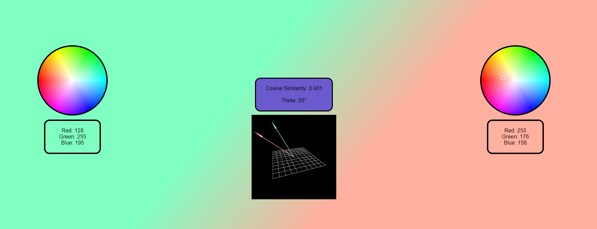

# RGB Vector Cosine Similarity Visualizer

This project provides a visual representation of the cosine similarity between RGB vectors. Crafted swiftly as a hands-on demo tool for elucidating AI concepts.



## Live Demo
[Check out the live demo here!](https://shardic-er.github.io/cosine-similarity/)
<iframe src="https://shardic-er.github.io/cosine-similarity/" width="100%" height="500" frameborder="0" scrolling="no"></iframe>


## Authors

- **Eli Ronai**
- **Austyn Harriman**

Crafted in just **2.5 hours** for a quick and insightful demo, thanks to ChatGPT and the react-color library.

## Features

- **Interactive Color Wheels**: Dual color wheels to select and exhibit RGB vectors.

- **Cosine Similarity & Theta**: Computes and showcases the cosine similarity between vectors and the associated Theta (angle difference).

- **3D Visualization**: Presents a 3D visualization of the two RGB vectors, with scroll and pan interactions for varied viewing angles.

- **Background Theta display**: Background gradient angle resonates with Theta.

## Quick Start

### Prerequisites

Ensure [Node.js](https://nodejs.org/) and [npm](https://www.npmjs.com/get-npm) are installed on your system.

### Installation

1. Clone the repository:
```
git clone https://github.com/shardic-er/cosine-similarity.git
```
2. Step into the project directory:
```
cd cosine-similarity
```
3. Install the necessary npm packages:
```
npm install
```

### Usage

Initiate the application:
```
npm start
```
Post initiation, the application is accessible at [http://localhost:3000](http://localhost:3000).

## Acknowledgements

- **ChatGPT**: A pivotal contributor, aiding in both design and rapid development. Also, the author of this readme!

- **React** (`react` and `react-dom`): The backbone UI framework of the project.

- **React Color Libraries** (`@uiw/react-color`, `react-color`, `react-color-wheel`, and `reactcss`): Enhanced the user experience with diverse color utilities.

- **Three.js** (`three`): A noteworthy 3D visualization tool, recommended by ChatGPT.

Kudos to the open-source ecosystem for nurturing these indispensable tools and libraries.